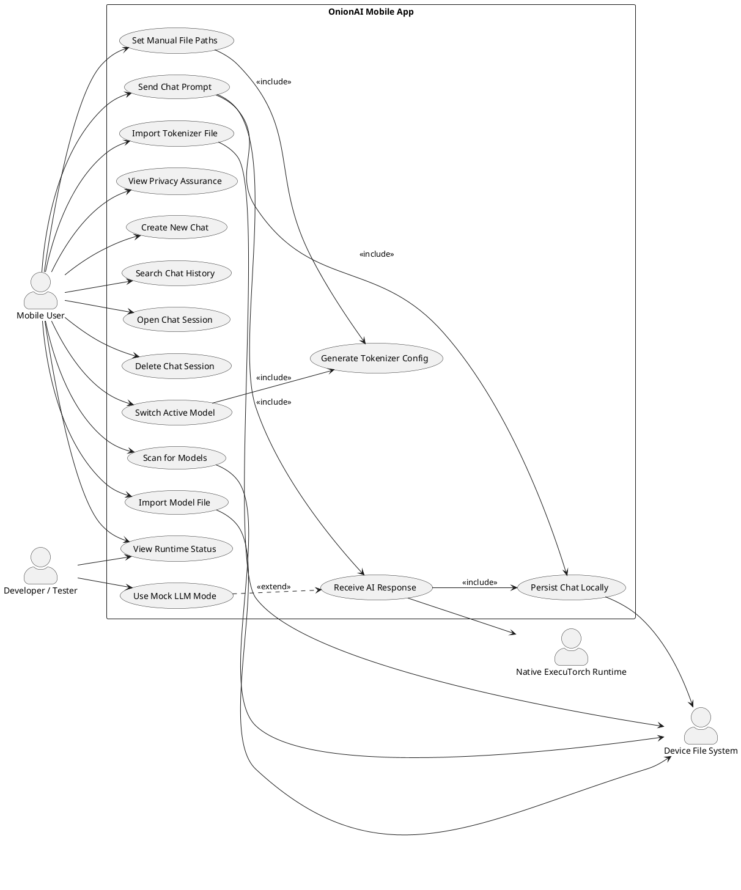
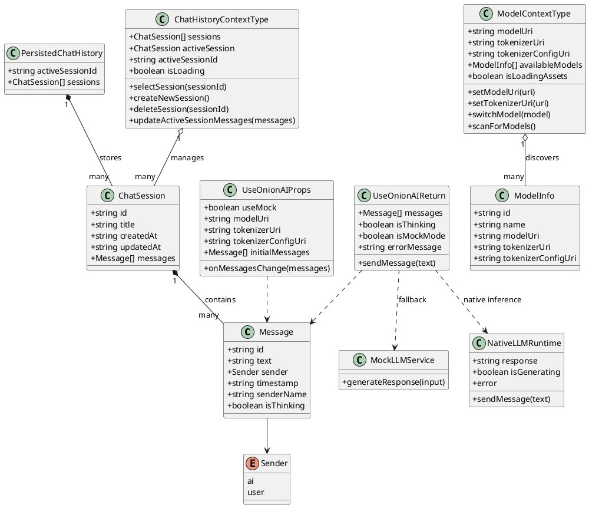
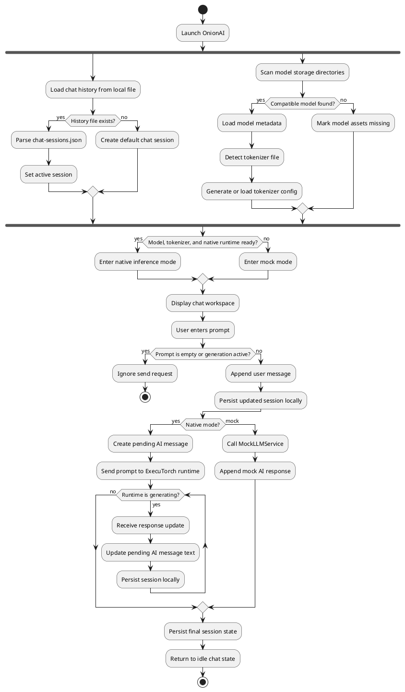
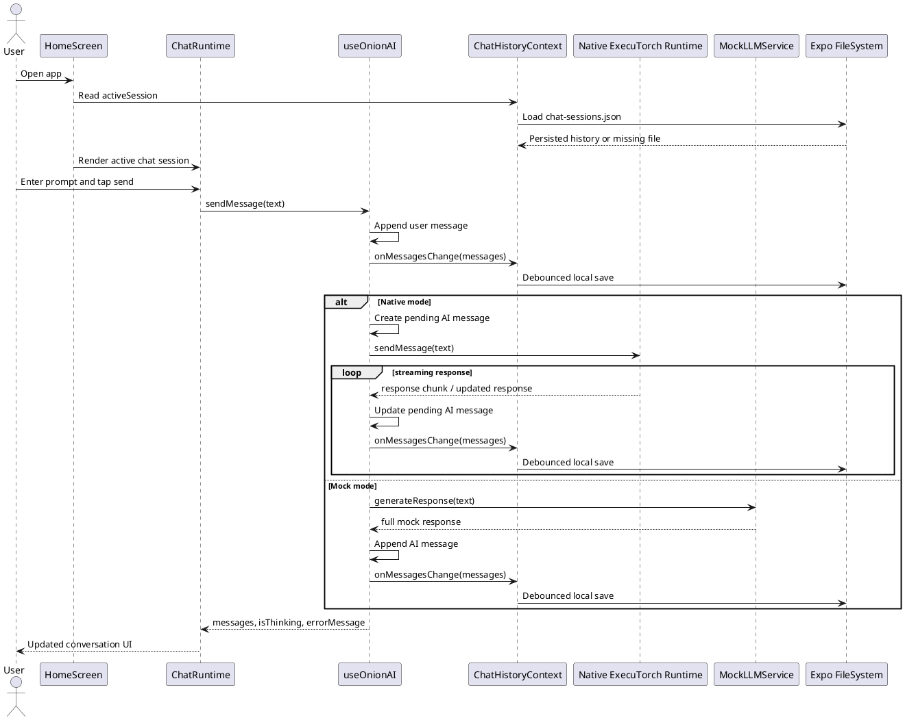
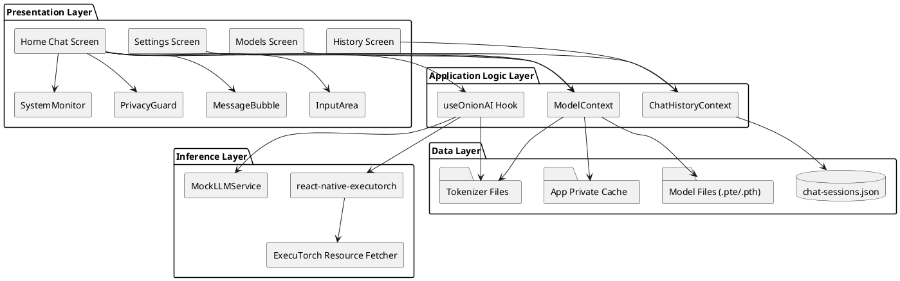
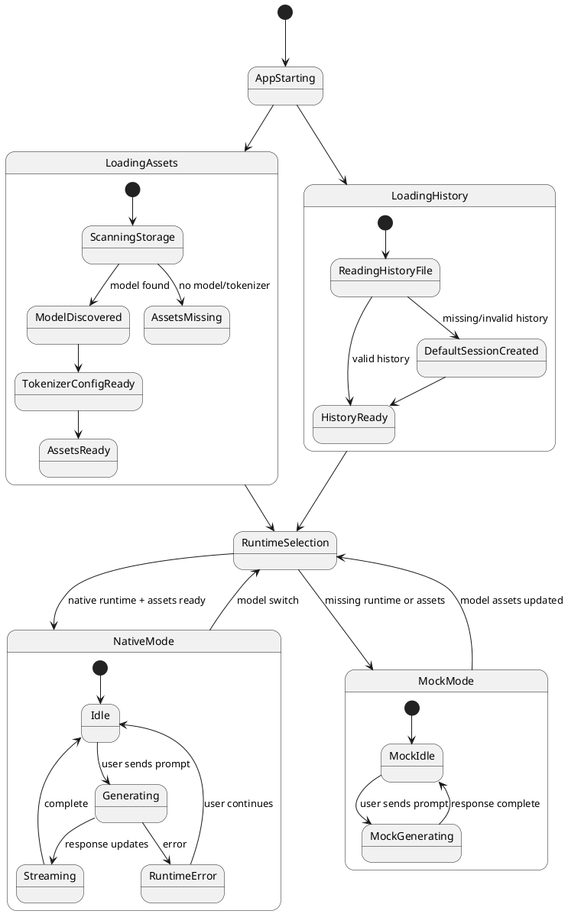
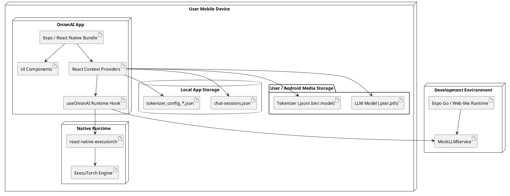
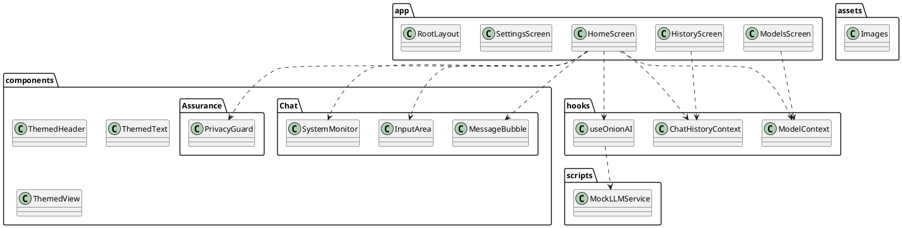

# OnionAI Software Requirements Specification

**Project Title:** OnionAI - Private, Local-First AI Chat for Mobile  
**Subject:** Software Design and Methodologies  
**Document Type:** Software Requirements Specification  
**Platform:** React Native / Expo mobile application  
**Version:** 1.0  

## Table of Contents

I. Introduction  
II. Problem Statement  
III. Project Objectives  
IV. Software Process Framework  
V. Platform Lifecycle  
VI. Software Models and Selection Rationale  
VII. System Requirement Gathering  
VIII. Functional Requirements  
IX. Non-Functional Requirements  
X. System Design Requirements  
XI. UML Design  
XII. Key Platform Features  
XIII. System Architecture  
XIV. Technology Stack  
XV. Expected Outcomes and Future Work  
XVI. Diagram Generation Prompt for Non-UML Visuals  

## I. Introduction

OnionAI is a privacy-centric AI chat application designed to run large language model inference directly on a user's mobile device. The application is built with React Native and Expo, and uses ExecuTorch through `react-native-executorch` to execute compatible LLM model files locally.

The central idea behind OnionAI is simple: private conversations with AI should not require prompts, responses, chat history, or personal context to leave the user's device. Traditional cloud-based AI assistants depend on remote inference servers, which introduces data transfer, third-party storage, availability dependence, and privacy concerns. OnionAI instead follows a local-first and local-only model where model files, tokenizer assets, chat sessions, and generated responses are managed on the device.

The application also includes a mock inference mode for development and unsupported environments. This allows the interface, chat history, model management, and user experience to be tested even when native ExecuTorch support is unavailable.

OnionAI is intended for users who need private assistance, offline access, and direct control over their AI model assets. The system is especially relevant for students, developers, researchers, professionals, and privacy-conscious users who want a mobile AI assistant without external API dependency.

## II. Problem Statement

AI chat applications are increasingly useful, but most common systems rely on cloud-hosted models. This creates a set of practical and privacy-related problems for users who want secure, offline, and self-controlled AI assistance.

### Core Problems Identified

1. **Cloud Dependence**
   Most AI assistants require an active internet connection and remote model execution. This makes them unavailable during network outages, travel, restricted environments, or poor connectivity.

2. **Data Privacy Risk**
   Cloud inference requires prompts and context to leave the device. Even when providers apply privacy controls, users still depend on external systems for transport, processing, logging policy, and retention policy.

3. **Limited User Control**
   Users often cannot choose exactly which model is running, where it is stored, or how it is loaded. Model updates and behavior changes are controlled by the service provider.

4. **High Latency and Variable Availability**
   Network requests can add latency, and service downtime or rate limits can interrupt the chat experience.

5. **Poor Offline Developer Workflow**
   Mobile AI applications that depend only on native inference are difficult to test in Expo Go or web-like development environments. A mock mode is needed to continue UI development without a compiled native runtime.

6. **Fragmented Local Model Setup**
   Users who run models locally often need to manually place model and tokenizer files in device storage. A dedicated model management interface is required to scan, validate, select, and switch model assets.

## III. Project Objectives

The OnionAI platform is guided by the following objectives:

- Enable private AI chat by running inference directly on mobile hardware.
- Support offline operation after model and tokenizer assets are available on the device.
- Provide a clean mobile chat interface with real-time message updates and thinking state feedback.
- Store chat history locally using device filesystem storage.
- Allow users to scan, select, and manually configure local model and tokenizer paths.
- Fall back to mock mode when native ExecuTorch runtime or model assets are unavailable.
- Communicate runtime status clearly through system monitor and privacy assurance components.
- Maintain a modular architecture so chat logic, model management, history persistence, and UI components can evolve independently.
- Support light and dark theming through reusable themed components.
- Prepare the codebase for future native builds, model encryption, improved token streaming, and broader model compatibility.

## IV. Software Process Framework

The Software Process Framework defines how OnionAI is planned, modeled, constructed, tested, and deployed. The framework is organized around the standard activities of communication, planning, modeling, construction, and deployment.

### Framework Activities

1. **Communication**
   The initial requirements are derived from privacy-focused AI assistant needs: local inference, no external API calls, offline usage, local persistence, and model asset control. The primary stakeholders are end users, mobile developers, and maintainers responsible for model integration.

2. **Planning**
   Planning defines the platform as a mobile-first local AI assistant. The project scope includes the chat runtime, model management screen, chat history screen, settings screen, and runtime status indicators. The selected stack is Expo, React Native, TypeScript, React Context, ExecuTorch, and Expo FileSystem.

3. **Modeling**
   System modeling identifies the main architectural layers: presentation, application logic, inference, and data storage. UML models describe the actors, classes, chat workflow, message processing sequence, component organization, deployment view, and application state lifecycle.

4. **Construction**
   Construction is performed module by module. The current codebase includes chat UI components, `useOnionAI` for inference orchestration, `ModelContext` for model asset discovery and selection, `ChatHistoryContext` for local chat persistence, and `MockLLMService` for development fallback behavior.

5. **Deployment**
   Deployment targets Android and iOS native builds through Expo. In Expo Go or unsupported runtime environments, OnionAI uses mock mode. For native inference, compatible `.pte` model files and tokenizer files must be placed in accessible storage and selected through the app.

## V. Platform Lifecycle

The lifecycle of OnionAI progresses through sequential yet iterative stages.

| Stage | Description |
| --- | --- |
| 1 - Requirement Analysis | Identify privacy, offline, model loading, chat persistence, and mobile UX requirements. |
| 2 - System Planning | Define architecture, platform constraints, development stack, and module ownership. |
| 3 - System Design | Produce UML diagrams, data models, screen flows, storage strategy, and inference integration design. |
| 4 - Development | Build the chat interface, model scanner, history manager, local inference bridge, and mock fallback. |
| 5 - Testing | Verify UI behavior, history persistence, model path validation, fallback behavior, and native inference readiness. |
| 6 - Deployment | Build and distribute native mobile apps with instructions for model and tokenizer setup. |
| 7 - Maintenance | Improve model compatibility, storage reliability, performance, security, and user experience based on testing feedback. |

## VI. Software Models and Selection Rationale

Three software development models were evaluated for OnionAI.

### Waterfall Model

The waterfall model follows a strict sequence: requirements, design, implementation, testing, deployment, and maintenance. This model is easy to document but unsuitable for OnionAI because native model execution, tokenizer compatibility, and mobile storage permissions require repeated experimentation.

### Incremental Model

The incremental model delivers the system in smaller functional parts. This is useful for OnionAI because modules such as chat, model scanning, history, and settings can be built independently. However, the model alone does not strongly support rapid feedback cycles around native runtime behavior.

### Agile Model {Selected}

Agile is the selected model because OnionAI benefits from short iterations, frequent testing, and continuous refinement. Native inference, mobile file access, tokenizer compatibility, and user interface behavior all require repeated validation on actual devices.

### Why Agile is the Right Fit for OnionAI

- Mobile AI runtime behavior depends on real device testing and cannot be fully validated through static design.
- Model loading, tokenizer fallback, and storage scanning require frequent adjustment.
- UI and UX can be improved through iterative testing of chat flow, model setup, and error visibility.
- Independent modules can be developed across sprints while still integrating into one mobile experience.
- Mock mode enables continued development even when native inference is temporarily unavailable.

## VII. System Requirement Gathering

Requirements for OnionAI were collected from project goals, current source code, local-first AI constraints, and expected user workflows.

Primary requirement sources include:

- Existing repository documentation in `README.md` and `docs/architecture.md`.
- Source code for `useOnionAI`, `ModelContext`, `ChatHistoryContext`, and `MockLLMService`.
- Expected mobile user flows: chat, model setup, history management, and settings review.
- Privacy and offline operation constraints.
- Compatibility requirements for Expo, React Native, ExecuTorch, Android storage, model files, tokenizer files, and local filesystem persistence.

The requirement analysis confirms that OnionAI is not just a chat UI. It is a local runtime management application that must coordinate model assets, tokenizer assets, chat state, filesystem persistence, and native inference availability.

## VIII. Functional Requirements

| ID | Requirement | Description |
| --- | --- | --- |
| FR01 | Local AI Chat | The user shall send prompts and receive AI responses through a mobile chat interface. |
| FR02 | On-Device Inference | The system shall use ExecuTorch for native local inference when compatible model and tokenizer assets are available. |
| FR03 | Mock Mode | The system shall provide a mock response service when native inference is unavailable or required assets are missing. |
| FR04 | Message Rendering | The system shall render user and AI messages with sender identity, timestamps, and chat bubble layout. |
| FR05 | Thinking State | The system shall display when the AI runtime is generating a response. |
| FR06 | Runtime Status Monitor | The system shall show whether it is in native mode or mock mode, whether generation is idle or active, and whether model files are ready. |
| FR07 | Privacy Indicators | The system shall display local-first privacy indicators such as on-device operation and zero-data-leak assurance. |
| FR08 | Chat History Persistence | The system shall persist chat sessions locally in `chat-sessions.json`. |
| FR09 | Chat Session Management | The user shall create, select, search, and delete local chat sessions. |
| FR10 | Automatic Chat Title | The system shall derive a chat title from the first user message in a session. |
| FR11 | Model Scanning | The system shall scan supported Android media directories for `.pte`, `.pth`, and related model files. |
| FR12 | Tokenizer Detection | The system shall detect tokenizer files such as `tokenizer.json`, `tokenizer.bin`, or `tokenizer.model`. |
| FR13 | Model Switching | The user shall switch between discovered model configurations. |
| FR14 | Manual Path Configuration | The user shall manually enter absolute file URIs for model and tokenizer files. |
| FR15 | Model File Import | The user shall select model and tokenizer files using document picker workflows. |
| FR16 | Tokenizer Config Generation | The system shall generate or load a tokenizer configuration file for runtime inference. |
| FR17 | Tokenizer Fallback | The system shall retry compatible tokenizer candidates when tokenizer loading fails. |
| FR18 | Local File Copy | The system shall copy eligible model assets into app-private storage when needed for runtime readability. |
| FR19 | Error Reporting | The system shall surface runtime errors related to missing files, tokenizer failures, or inference unavailability. |
| FR20 | Settings Display | The system shall display model preferences, privacy guard status, appearance options, and application version information. |

## IX. Non-Functional Requirements

| Attribute | Requirement Detail |
| --- | --- |
| Privacy | Prompt text, generated responses, chat history, and model assets must remain on the user's device during normal operation. |
| Security | Local history and model assets should be protected by platform storage controls; future versions should support local encryption for history and weights. |
| Usability | The chat interface, model setup, and history screens must be understandable to non-technical mobile users while still exposing useful diagnostics. |
| Performance | UI interactions should remain responsive while model assets are scanned, copied, or loaded. Native response streaming should update the active AI message progressively. |
| Reliability | Missing assets, unsupported runtime modules, or tokenizer failures must not crash the app; the system should fall back to mock mode or show clear errors. |
| Maintainability | Chat logic, model discovery, history persistence, and presentation components must remain modular and independently testable. |
| Portability | The app should support Android and iOS native builds through Expo and React Native, with graceful behavior in Expo Go. |
| Scalability | The local history system should support many chat sessions without excessive UI delay; future storage abstractions may be needed for large histories. |
| Compatibility | The system must support ExecuTorch-compatible model files and common tokenizer formats used by supported LLMs. |
| Availability | Core chat functionality should remain available offline when model assets and runtime dependencies are present. |

## X. System Design Requirements

OnionAI is structured into four major technical layers.

### 1. User Interface Layer

The user interface layer contains screens and reusable components implemented in React Native:

- Home chat screen
- History screen
- Models screen
- Settings screen
- `ThemedHeader`
- `MessageBubble`
- `InputArea`
- `SystemMonitor`
- `PrivacyGuard`

This layer is responsible for rendering, navigation, user input, feedback states, and visual assurance.

### 2. Application Logic Layer

The application logic layer coordinates state and workflows:

- `useOnionAI` manages messages, response generation, mock/native mode selection, runtime errors, and streaming synchronization.
- `ChatHistoryContext` manages sessions, active session selection, deletion, title derivation, and local persistence.
- `ModelContext` manages model discovery, tokenizer discovery, asset copying, tokenizer configuration, and model switching.

### 3. Inference Layer

The inference layer abstracts the actual language model runtime:

- Native mode uses `react-native-executorch`.
- Resource fetching is initialized through `react-native-executorch-expo-resource-fetcher`.
- Mock mode uses `MockLLMService` for development and fallback behavior.
- Tokenizer fallback logic retries alternative tokenizer file paths when native loading fails.

### 4. Data Layer

The data layer stores application state and runtime assets locally:

- Chat sessions are stored in `chat-sessions.json`.
- Model files are stored in Android media directories, app-private directories, or user-selected locations.
- Tokenizer files and generated tokenizer configuration files are stored locally.
- Model cache directories are created under app-private filesystem storage when copying is required.

## XI. UML Design

This section contains PlantUML source for all major UML diagrams required for the OnionAI SRS.

### 1. Use Case Diagram



### 2. Class Diagram



### 3. Activity Diagram



### 4. Sequence Diagram



### 5. Component Diagram



### 6. State Diagram



### 7. Deployment Diagram



### 8. Package Diagram



## XII. Key Platform Features

| Feature | Detail |
| --- | --- |
| Local-First AI Chat | Prompts and responses are handled on the mobile device when native model assets are configured. |
| On-Device Inference | ExecuTorch enables local LLM execution without a cloud API dependency. |
| Mock Mode | Development fallback keeps the UI and workflows testable when native inference is unavailable. |
| Chat History | Conversations are stored locally and can be searched, selected, created, and deleted. |
| Model Manager | Users can scan storage, select discovered models, choose files, or enter manual model/tokenizer paths. |
| Tokenizer Handling | The app detects tokenizers, creates tokenizer config files, and retries fallback tokenizer paths after load failures. |
| Runtime Monitor | The interface shows native/mock mode, generation state, model readiness, and error messages. |
| Privacy Guard | The UI communicates that inference and data storage are intended to remain on-device. |
| Themed Mobile Interface | The app uses reusable themed components and a dark mobile interface. |
| Offline Capability | Once model files are available, the application can operate without internet access. |

## XIII. System Architecture

OnionAI uses a layered mobile architecture that separates UI rendering, application state, inference execution, and local persistence.

| Layer | Components and Responsibilities |
| --- | --- |
| Presentation Layer | Home chat screen, history screen, models screen, settings screen, themed header, message bubble, input area, runtime monitor, privacy guard. |
| Application Logic Layer | `useOnionAI`, `ModelContext`, and `ChatHistoryContext` manage user workflows, inference selection, model asset state, and local sessions. |
| Inference Layer | `react-native-executorch` runs compatible models in native mode; `MockLLMService` provides fallback responses in mock mode. |
| Data Layer | Expo FileSystem stores chat history, generated tokenizer config files, model cache copies, and reads user-controlled model/tokenizer files. |

### Architecture Summary

The chat screen reads active session state from `ChatHistoryContext` and model readiness from `ModelContext`. It passes model URIs, tokenizer URIs, and initial messages into `useOnionAI`. The hook decides whether to use native ExecuTorch mode or mock mode. Every message update is propagated back to `ChatHistoryContext`, which persists the session through Expo FileSystem.

The models screen interacts with `ModelContext` to scan known storage directories, detect model/tokenizer combinations, select an active model, or save manual file paths. Tokenizer configuration is generated at runtime if a model does not provide a readable config.

## XIV. Technology Stack

| Domain | Technologies |
| --- | --- |
| Mobile Framework | Expo SDK 54, React Native 0.81 |
| Routing | Expo Router |
| Language | TypeScript |
| UI | React Native components, custom themed components, Material Icons |
| State Management | React Context, React hooks |
| AI Runtime | `react-native-executorch`, ExecuTorch |
| Runtime Resource Fetching | `react-native-executorch-expo-resource-fetcher` |
| Local Storage | Expo FileSystem legacy API |
| File Selection | Expo Document Picker |
| Development Fallback | `MockLLMService` |
| Build Tooling | Expo CLI, npm scripts |
| Target Platforms | Android and iOS native builds |

## XV. Expected Outcomes and Future Work

### Expected Outcomes

- A working mobile AI chat app that prioritizes user privacy and local control.
- Successful local chat session persistence without server-side storage.
- Model discovery and switching workflows for ExecuTorch-compatible assets.
- Clear fallback behavior when model assets or native runtime support are unavailable.
- A maintainable React Native codebase with separated UI, state, inference, and storage concerns.
- A strong foundation for private offline AI workflows on mobile devices.

### Future Work

1. **Encrypted Local History**
   Add encryption for `chat-sessions.json` and any cached model metadata.

2. **Improved Model Compatibility**
   Expand support for more ExecuTorch-compatible model families and tokenizer formats.

3. **Download Manager**
   Add a verified model download workflow with checksum validation and progress tracking.

4. **Streaming UX Improvements**
   Improve token-by-token rendering, cancellation, retry, and partial response recovery.

5. **Prompt Templates and System Instructions**
   Allow users to create local prompt profiles without uploading data to a server.

6. **Performance Metrics**
   Display tokens per second, memory usage, inference backend, and load time diagnostics.

7. **Cross-Platform Storage Abstraction**
   Add iOS-specific model import and storage workflows equivalent to Android media scanning.

8. **Automated Test Coverage**
   Add unit tests for contexts and hooks, plus integration tests for chat and model selection flows.

9. **Accessibility Improvements**
   Strengthen screen reader labels, touch targets, color contrast, and reduced-motion behavior.

10. **Local RAG Support**
   Add optional local document indexing and retrieval so users can chat with private files on-device.

## XVI. Diagram Generation Prompt for Non-UML Visuals

All required UML diagrams above are expressible in PlantUML. However, PlantUML is not ideal for high-fidelity UI mockups, polished presentation graphics, or visual app-screen compositions. Use the following Nano Banana prompt if a rendered visual summary or UI mockup sheet is required.

```prompt
Create a polished SRS visual board for a mobile app named OnionAI. The board should show a privacy-focused local AI chat application running on a smartphone, with four clean app screens: Chat, History, Models, and Settings. The Chat screen should show user and AI message bubbles, a local runtime status bar, and privacy badges reading "100% On-Device" and "Zero Data Leak". The Models screen should show local model file selection, tokenizer readiness, scan storage, and manual path fields. Add a small architecture strip showing Presentation Layer, Application Logic Layer, Inference Layer with ExecuTorch and Mock Mode, and Local Data Layer with chat-sessions.json and model/tokenizer files. Use a modern dark mobile UI, cyan and green privacy accents, crisp readable labels, and an academic software documentation style suitable for a Software Requirements Specification report.
```
