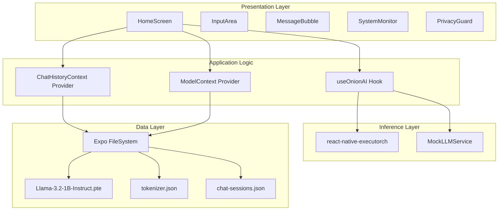
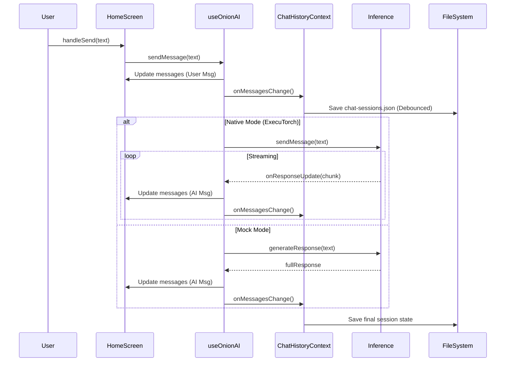
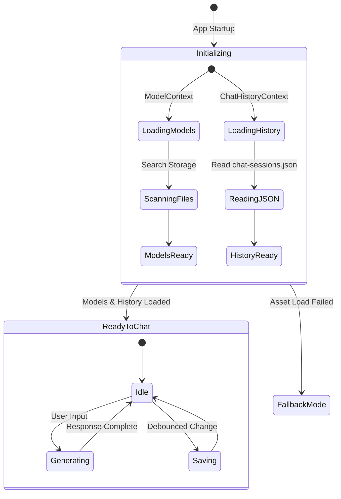
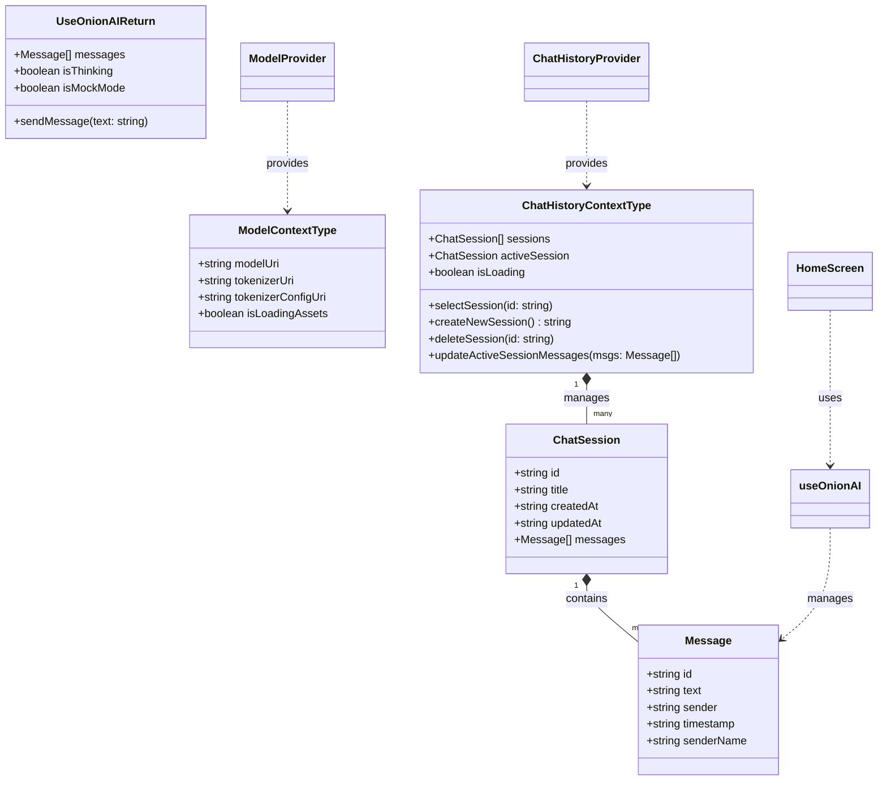

# OnionAI Architecture

This document describes the high-level architecture and system design of OnionAI,
a private, local-first AI chat application.

## System Overview

OnionAI is designed to provide secure, offline-capable AI chat using Large
Language Models (LLMs) directly on mobile devices. It leverages ExecuTorch for
high-performance on-device inference and React Native for a cross-platform user
experience.

## Technical Stack

OnionAI is built using modern mobile development technologies:

- **Framework:** Expo SDK 54 (React Native 0.81).
- **Navigation:** Expo Router for file-based routing.
- **AI Engine:** ExecuTorch for on-device inference.
- **State Management:** React Context (Model and History providers).
- **Architecture:** React Native New Architecture enabled with React Compiler.
- **Styling:** Themed components supporting light and dark modes.

## Component Architecture

The following diagram illustrates the relationship between the major layers of
the application.

### Layer Responsibilities

- **Presentation Layer:** Handles user interaction and rendering. Components are
  built with React Native and themed for light/dark mode support.
- **Application Logic:** Manages the state of the chat, model configuration, and
  orchestration between the UI and inference engines.
- **Inference Layer:** Provides the execution environment for LLMs. It abstracts
  the native `react-native-executorch` module.
- **Data Layer:** Manages access to model binaries and tokenizer configurations
  stored on the device's local filesystem.

## Interaction Flow

The sequence diagram below shows how a message is processed from user input to
AI response.

## System Lifecycle

OnionAI undergoes a strict initialization phase to ensure model assets are
available before chat begins.

## Data Models and Interfaces

The following class diagram represents the core data structures and hooks used
within the application logic.

## Data Privacy Model

OnionAI follows a "Local-First, Local-Only" privacy model:

1.  **Zero Telemetry:** No chat data or model prompts are sent to external
    servers.
2.  **On-Device Inference:** All neural network computations happen on the
    device's NPU/GPU/CPU via ExecuTorch.
3.  **Local Storage:** Model weights and chat history (if persistent) remain in
    private app storage or user-controlled folders.
