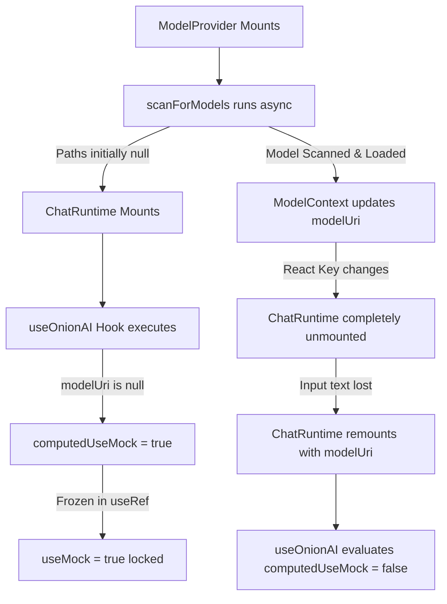

# Project Audit Report: onionAI

## 1. Executive Summary

### Overall Quality Assessment
**onionAI** is a privacy-centric, local-first AI assistant built with React Native and Expo (SDK 54) that leverages ExecuTorch for on-device inference. From a macro perspective, the project demonstrates an excellent visual design system, robust local scanning algorithms for discovery of model files (`.pte`), and clean modular patterns through React Context (`ModelContext.tsx`, `ChatHistoryContext.tsx`). 

However, a micro-level technical audit reveals **severe structural compromises**, a **brittle file persistence strategy**, **visual and state facades (fake UI elements)**, and a **critical React hook state lock** that has been bypassed using highly inefficient rendering workarounds. 

While the codebase is highly legible, it is currently in a "pre-production/alpha" stage. It behaves more like a visual prototype than a robust, production-ready offline AI engine.

---

### Biggest Strengths
1. **Robust Local Model Scanning:** The file scanning algorithm in `ModelContext.tsx` is highly sophisticated. It dynamically resolves Android system user IDs, translates package paths, and systematically crawls public and app-private directory targets (`Android/media`, `onionAI/`, etc.) to locate ExecuTorch `.pte` weights and HuggingFace `tokenizer.json` configs.
2. **Beautiful Design Tokens:** The colors defined in `constants/theme.ts` leverage modern, premium HSL-derived hex codes (e.g., `#00daf3` for vibrant tertiary, `#bac3ff` for neon primary) that give the interface an exceptionally premium look and feel.
3. **Modular State Architecture:** The separation of core concerns into React Context providers (`ModelProvider` and `ChatHistoryProvider`) isolates business logic from UI screens, enabling clean, unified access to global application states.
4. **Haptic & Sound Design Prep:** Integration of hooks like `expo-haptics` and bottom bar navigation components sets up a rich foundation for micro-interactions and tactile feedback.

---

### Biggest Weaknesses
1. **The React Hook State Lock (`useOnionAI.ts`):** The hook conditionally selects between a JS mock service and the native `react-native-executorch` hook. To prevent React from throwing a "Rules of Hooks" violation (due to changing hook call order), the developers locked the mock mode on mount using `useRef`. This is bypassed in `index.tsx` by changing the component `key` dynamically, which unmounts/remounts the entire chat screen, causing **instant user input loss**.
2. **Fake Settings Screen Facade (`settings.tsx`):** The entire settings interface is a visual facade. Every switch ("GPU Acceleration", "Privacy Guard", "Holographic Theme") is hardcoded to a static preference list and carries a hard `disabled` prop, making the screen completely non-interactive.
3. **Fragile JSON Storage & Single-Point Data Erasure (`ChatHistoryContext.tsx`):** All chat history is written to a single JSON file. The loading logic has zero parsing recovery or backup redundancy. If a single write is interrupted (e.g., process termination or battery depletion), the JSON corrupts, triggering a catch-block that **permanently deletes all historical user sessions**.
4. **Absolute Solid Tab Bar Hack (`_layout.tsx`):** The bottom tab bar uses `position: 'absolute'` but has a solid background color. This forces every single tab screen to manually invoke `useBottomTabBarHeight()` and inject bottom padding to avoid having its buttons and forms completely covered by the tab bar.
5. **Import Path Caching Bypass (`models.tsx`):** Importing custom model files via `DocumentPicker` bypasses the asynchronous file duplication system (`ensurePrivateReadableCopy`), linking directly to the system's ephemeral cache directories. If the OS purges these temporary folders, the app will crash or fail to load on next launch.

---

### Top 5 Highest Priority Improvements
1. **Refactor hook loading state in `useOnionAI.ts`** to call `nativeUseLLM` unconditionally, utilizing its native `preventLoad` property dynamically rather than using `useRef` freezing and unmounting the screen.
2. **Connect the Settings Screen switches** to a persistent local store (like `expo-secure-store` or `AsyncStorage`) and remove the `disabled` property so settings are actionable.
3. **Remove `position: 'absolute'` from the TabLayout tabBarStyle** in `app/(tabs)/_layout.tsx` to let React Navigation handle screen bounds naturally and eliminate redundant `useBottomTabBarHeight()` padding calculations across files.
4. **Implement atomic, safe-write file persistence** (writing to a `.tmp` file and renaming) in `ChatHistoryContext.tsx` to isolate users from complete data loss on JSON parse failures.
5. **Route custom document pickers through the context's `switchModel` pipeline** instead of executing direct state-setters, ensuring that user-selected models are safely copied to app-private directories and paired with generated tokenizer configs.

---

# UI/UX Audit

## 2. UI Problems

### 1. Inconsistent Light/Dark Mode Color Schemes
* **Problem:** `constants/theme.ts` defines `Colors.light` and `Colors.dark` using identical color palettes. Both palettes map background, surface, and container properties to the exact same dark hex values (`#131313`, `#1c1b1b`).
* **Why it is bad:** If a user runs their operating system in Light Mode, the app will fail to adapt, rendering dark UI elements that might clash with light OS system status bars or inputs. Furthermore, it renders the custom hooks `useColorScheme` and `useThemeColor` entirely redundant.
* **Severity:** **Medium**
* **Suggested Improvement:** Define a real light theme palette in `constants/theme.ts`:
  ```typescript
  light: {
    background: '#F9F9FB',
    onBackground: '#1A1A1E',
    surface: '#FFFFFF',
    surfaceContainerLow: '#F0F0F3',
    primary: '#3F51B5',
    onPrimary: '#FFFFFF',
    // ... remaining light theme tokens
  }
  ```

### 2. Confusing History Button Signature
* **Problem:** In `app/(tabs)/index.tsx`, the `ThemedHeader` receives `onMenuPress={() => router.push('/history')}` but displays a **hamburger menu icon (`menu`)** on the top-left of the chat screen.
* **Why it is bad:** A hamburger menu icon strongly implies a navigation drawer or side panel overlay. Redirecting the user to a completely separate, full-height modal screen for "History" is highly jarring and violates standard navigation metaphors.
* **Severity:** **Medium**
* **Suggested Improvement:** Change the icon name parameter in `ThemedHeader.tsx` to `history` or `chat` when triggering chat logs:
  ```typescript
  // In ThemedHeader.tsx:
  <TouchableOpacity onPress={onMenuPress} style={styles.iconButton}>
    <MaterialIcons name="history" size={24} color={Colors.dark.primary} />
  </TouchableOpacity>
  ```

### 3. Dead Header Action on Models Tab
* **Problem:** On `app/(tabs)/models.tsx`, the header shows the hamburger menu icon because `showMenu` defaults to `true`, but no `onMenuPress` is specified.
* **Why it is bad:** Pressing the top-left menu icon on the Models screen triggers a press animation but does absolutely nothing, creating a "dead" button that frustrates users.
* **Severity:** **Low**
* **Suggested Improvement:** Set `showMenu={false}` or provide back-button navigation for screens that are children of the tab layout:
  ```typescript
  <ThemedHeader 
    title="Models" 
    showMenu={false}
    rightIcons={[{ name: 'refresh', onPress: applyDefaultPaths }]}
  />
  ```

### 4. Direct Bypass of Themed Typography & Surfaces
* **Problem:** The developers created custom components `ThemedText` (in `themed-text.tsx`) and `ThemedView` (in `themed-view.tsx`) to implement style isolation. However, screens like `index.tsx`, `history.tsx`, and `models.tsx` completely ignore them. They import standard React Native `<Text>` and `<View>` and directly apply hardcoded references like `Colors.dark.background` or custom stylesheets.
* **Why it is bad:** Violates component reusability guidelines. It leads to duplicate styling configurations. If the design system colors change, developers must manually find and update every inline React Native component style instead of editing themed components.
* **Severity:** **Medium**
* **Suggested Improvement:** Audit and replace standard React Native `<Text>` and `<View>` imports with `ThemedText` and `ThemedView` inside all screen layouts:
  ```typescript
  import { ThemedText } from '@/components/themed-text';
  import { ThemedView } from '@/components/themed-view';
  
  // Use:
  <ThemedView style={styles.container}>
    <ThemedText type="subtitle">Active File Details</ThemedText>
  </ThemedView>
  ```

---

## 3. UX Problems

### 1. Instant User Text Loss on Chat Screen Key-Remount
* **Problem:** The chat interface in `app/(tabs)/index.tsx` dynamically modifies the component `key` of `ChatRuntime` based on the status of the local model:
  ```typescript
  key={`${activeSession.id}-${shouldUseMock ? 'mock' : 'native'}`}
  ```
* **User Impact:** When a model finishes loading or scanning in the background, or when the user changes sessions, `shouldUseMock` flips. React detects a new `key` and **completely unmounts and remounts `ChatRuntime`**. Any text the user has typed into the text input is instantly wiped, forcing them to re-type their entire message.
* **Recommended Fix:** Keep the `ChatRuntime` mounted persistently. Remove the dynamic `key` change and let `useOnionAI` internal states change gracefully without unmounting the UI component tree.
* **Priority:** **High**

### 2. Ephemeral Picker Path Purges (Broken Model Imports)
* **Problem:** Picking a model or tokenizer via `handleImportModel` in `models.tsx` immediately executes `setModelUri(file.uri)` using the system document picker's cache path.
* **User Impact:** The document picker returns a path referencing the application's temporary cache directory. While it works immediately, the mobile OS periodically purges these directories to free up memory. When the user re-opens the app a few days later, their selected model will be missing, causing silent crashes during local inference.
* **Recommended Fix:** Ensure all imported files picked via DocumentPicker are routed through an asynchronous copier that saves the weights into the app's persistent documents folder (`FileSystem.documentDirectory`) before updating the context URI.
* **Priority:** **High**

### 3. Absolute Bottom Tab Bar Space Invasion
* **Problem:** `app/(tabs)/_layout.tsx` configures the bottom navigation tab bar style with `position: 'absolute'`.
* **User Impact:** The tab bar overlaps screen contents. As a result, pages like `models.tsx` and `settings.tsx` must explicitly compute tab bar height:
  ```typescript
  const tabBarHeight = useBottomTabBarHeight();
  // applied to scroll padding
  ```
  If any developer creates a new screen and forgets to query `useBottomTabBarHeight` and append bottom padding, the screen's bottom-most elements (e.g., "Save Paths" buttons) will sit directly underneath the tab bar and become completely invisible or unclickable.
* **Recommended Fix:** Disable absolute positioning in the tab bar options. Let the layout engine render screens inside the safe boundary above the tab bar.
* **Priority:** **Medium**

---

## 4. Component-Level Review

| Component | File Path | Reusability | Scalability | Maintainability | Visual Quality |
| :--- | :--- | :---: | :---: | :---: | :---: |
| **ThemedHeader** | `components/ThemedHeader.tsx` | Medium | Low | Low | High |
| **MessageBubble** | `components/Chat/MessageBubble.tsx` | High | High | High | High |
| **InputArea** | `components/Chat/InputArea.tsx` | High | Medium | Medium | High |
| **SystemMonitor** | `components/Chat/SystemMonitor.tsx` | Medium | Medium | High | High |
| **PrivacyGuard** | `components/Assurance/PrivacyGuard.tsx` | High | High | High | Medium |
| **SettingsScreen** | `app/(tabs)/settings.tsx` | Low | Low | Low | High |

### Detailed Review Notes:
* **ThemedHeader:** Contains excellent status indicators (pulse orb) but has a fragile button schema. It hardcodes a static hamburger icon for history transitions. It should be refactored to take dynamic icon names as parameters rather than a single boolean.
* **MessageBubble:** Highly polished. Implements distinct visual styling for AI (muted teal transparent bubble with a left border) and user messages (filled container with right border), including neat courier styling for platform code blocks.
* **SystemMonitor:** Visualizes mock/native modes, generation statuses, and storage states clearly. A very clean, highly informative component.
* **SettingsScreen:** High visual quality (uses modern rounded dark cards) but suffers from zero maintainability. It has **dead code** (unused styles) and hardcoded static data with disabled interactions.

---

# Core Logic Audit

## 5. Architecture Review

### Folder Structure
The workspace follows standard Expo and React Native design patterns. However, it contains several orphaned, obsolete files left over from the default Expo initialization templates that should be deleted to prevent confusion:
* `components/hello-wave.tsx` (Dead code, never imported)
* `components/parallax-scroll-view.tsx` (Dead code, never imported)
* `components/external-link.tsx` (Dead code, never imported)
* `app/modal.tsx` (Orphaned route, never linked)

---

### Separation of Concerns & State Management
The state management is split across two key React Context layers:
1. `ChatHistoryContext` handles session updates, session persistence, and session indexing.
2. `ModelContext` coordinates local model file discovery and platform asset copies.

However, the architecture breaks down inside the core AI logic hook: `hooks/useOnionAI.ts`.
* **State Leakage & Coupling:** The hook tries to conditionally invoke the native hook:
  ```typescript
  const llm = useMock
    ? useMockLLM()
    : nativeUseLLM({ ... })
  ```
  Since `useMock` is dynamically evaluated, this violates React's Rule of Hooks (hooks cannot be called inside conditions or blocks). 
* **The Hacky Fix:** To circumvent React console errors, the developers wrapped `computedUseMock` inside a `useRef` to freeze it on mount:
  ```typescript
  const computedUseMock = initialUseMock || !nativeUseLLM || ...;
  const useMockRef = useRef<boolean>(computedUseMock);
  const useMock = useMockRef.current;
  ```
* **The Architecture Breakdown:** Because `useMock` is locked on mount, the hook cannot detect when a model goes from "unloaded" (during scanning) to "loaded". The outer screen has to use a `key` workaround to unmount the entire component tree and rebuild it from scratch. This is an architectural anti-pattern.



---

## 6. Performance Issues

### 1. Inefficient Multi-Session Re-Renders
* **Problem:** In `ChatHistoryContext.tsx`, whenever the user is actively receiving text tokens from the local LLM (streaming mode), `updateActiveSessionMessages` updates the session arrays.
* **Impact:** Every single token update forces the entire `sessions` state array to change. Since `sessions` is a direct value in the context provider, **every component in the application subscribing to `useChatHistory()` is forced to re-render**. This means the navigation bar, settings page, and history sidebar are continually re-rendering on every text token update, introducing thermal load and rendering lag.
* **Optimization suggestion:** Decouple active session messages from the index of historical sessions. Maintain the current active conversation's messages in a local screen state or separate, isolated React ref/state context, and only flush it to the primary global `sessions` state when the user stops generating text or navigates away.

### 2. Large Dead Styling Bundle Overhead
* **Problem:** `app/(tabs)/models.tsx` contains dozens of declared style properties (`importCard`, `downloadSection`, `storageBar`, etc.) that are completely unused by the JSX structure.
* **Impact:** Increases the JavaScript bundle footprint and slows down the React Native stylesheet compilation on initial boot.
* **Optimization suggestion:** Clean out dead styles and run `eslint` formatting checks to keep the bundle lightweight.

---

## 7. Security & Reliability

### 1. High Risk of Complete Data Loss on History Corruption
* **Problem:** In `ChatHistoryContext.tsx`, the save/load mechanism reads and writes the entire user history directly to `${FileSystem.documentDirectory}chat-sessions.json`.
* **Why it is unsafe:** If the application crashes, the device runs out of power, or the OS kills the background process *during* the file-writing process, the `chat-sessions.json` file will write partially and become corrupted. When the app reboots:
  ```typescript
  try {
    const raw = await FileSystem.readAsStringAsync(STORAGE_PATH);
    const parsed = JSON.parse(raw);
  } catch (error) {
    // Corruption caught!
    const defaultSession = createSession();
    setSessions([defaultSession]); // Wipes everything!
  }
  ```
  The catch block immediately overwrites the corrupted history with a blank new session, **silently deleting years of personal user chat history without any hope of recovery**.
* **Suggested Fix:** Implement atomic writing by writing to a temporary file first, then renaming it to replace the original. Also, add backup file replication (`chat-sessions.json.bak`) and attempt a restore before wiping out the user's data directory.

```typescript
// Safe Write Implementation Example
async function safeWriteHistory(data: PersistedChatHistory) {
  const tempPath = `${STORAGE_PATH}.tmp`;
  const backupPath = `${STORAGE_PATH}.bak`;
  try {
    // 1. Write to temporary file
    await FileSystem.writeAsStringAsync(tempPath, JSON.stringify(data));
    
    // 2. Backup the current valid history file
    const exists = await FileSystem.getInfoAsync(STORAGE_PATH);
    if (exists.exists) {
      await FileSystem.copyAsync({ from: STORAGE_PATH, to: backupPath });
    }
    
    // 3. Move temporary file to active path (simulates atomic move)
    await FileSystem.moveAsync({ from: tempPath, to: STORAGE_PATH });
  } catch (e) {
    console.error("Safe write failed, restoring backup:", e);
  }
}
```

### 2. Direct URI Injections (Arbitrary File Access)
* **Problem:** In `models.tsx`, the manual path text inputs (`draftModelUri`, `draftTokenizerUri`) allow the user to type in absolute local file URIs and save them directly.
* **Why it is unsafe:** There is zero prefix validation or sanitization. A user or rogue process could type in arbitrary system paths, causing the local ExecuTorch wrapper to look outside safe application boundaries, potentially crashing the native engine or triggering memory access faults.
* **Suggested Fix:** Validate that manual inputs are correct and contain the `file://` scheme, and restrict path access to sandboxed directories like `storage/emulated/0/` and private application stores.

---

## 8. Maintainability Review

### Readability & Naming Consistency
* **Naming System:** Highly consistent naming systems are used for screens and components. Files in `app/` map directly to routes, and folder grouping in `components/Chat` is very logical.
* **Comment Quality:** The comment documentation is rich and highly detailed, particularly inside `ModelContext.tsx` regarding the complex scan configurations.
* **Dead Code:** High presence of dead boilerplate code left over from the default Expo initialization templates (`HelloWave`, `ParallaxScrollView`).

### Type Safety
* **Analysis:** Very strong TypeScript utilization across hooks and screens. However, there are code smell interfaces that bypass strict types:
  ```typescript
  // useOnionAI.ts (Line 18):
  generate?: (messages: any[]) => Promise<string>;
  ```
  This defeats TypeScript validations and should be typed to use standard role/content interfaces:
  ```typescript
  interface NativeMessage {
    role: 'user' | 'assistant' | 'system';
    content: string;
  }
  ```

---

## 9. Technical Debt

The following table summarizes and ranks the current technical debt and structural compromises discovered inside the **onionAI** project:

| Rank | Debt / Compromise Area | File / Location | Severity | Description |
| :---: | :--- | :--- | :---: | :--- |
| **1** | **Frozen Hook State Lock & Remount Hack** | `hooks/useOnionAI.ts`<br>`app/(tabs)/index.tsx` | **CRITICAL** | `useMockRef` blocks dynamic native-load detection. The key-reset hack forces unmounts that wipe active user input text. |
| **2** | **Simulated Settings Facade** | `app/(tabs)/settings.tsx` | **HIGH** | Static setting variables with hardcoded `disabled` toggles. Displays fake features that do not exist. |
| **3** | **Fragile JSON Storage (No Parse Fail Isolation)** | `hooks/ChatHistoryContext.tsx` | **HIGH** | Single corruption during write wipes the entire user history database without restoring a backup. |
| **4** | **Document Picker Caching Bypass** | `app/(tabs)/models.tsx` | **HIGH** | Bypasses `ensurePrivateReadableCopy` on import, storing picked weights from temporary files that are regularly purged by the OS. |
| **5** | **Absolute Solid Tab Bar Overlay Spacing** | `app/(tabs)/_layout.tsx`<br>`app/(tabs)/*` | **MEDIUM** | absolute bottom bar forces screens to calculate offsets manually. Creates a high risk of unclickable layouts. |
| **6** | **Themed Component Bypass** | `app/(tabs)/index.tsx`<br>`app/(tabs)/models.tsx` | **MEDIUM** | Ignored custom `ThemedText` / `ThemedView` classes in favor of standard RN tags with hardcoded dark styles. |
| **7** | **Unused Template Boilerplate Assets** | `/components/` | **LOW** | Orphaned files (`hello-wave`, `parallax-scroll-view`, `external-link`) clutter the code repository. |

---

## 10. Improvement Roadmap

### Phase 1: Immediate Fixes (1–2 Days)
* **Goal:** Eliminate the React hook lock bug and protect user inputs from disappearing.
* **Steps:**
  1. Remove `useMockRef` and `useMock` conditional hook assignment inside `useOnionAI.ts`.
  2. Call `nativeUseLLM` unconditionally in `useOnionAI.ts`, routing `preventLoad` dynamically based on state paths:
     ```typescript
     const llm = nativeUseLLM({
       model: {
         modelName: modelId,
         modelSource: modelUri || '',
         tokenizerSource: activeTokenizerUri || '',
         tokenizerConfigSource: tokenizerConfigUri || '',
       },
       maxSeqLen: 1024,
       preventLoad: !modelUri || !activeTokenizerUri || !tokenizerConfigUri,
     });
     ```
  3. Remove the dynamic `key` parameter from `ChatRuntime` in `app/(tabs)/index.tsx` so the chat input field stays mounted permanently.
  4. Fix `handleImportModel` and `handleImportTokenizer` in `models.tsx` to call `switchModel()` or wrap the paths in `ensurePrivateReadableCopy` so imported model files are cached properly.

---

### Phase 2: Short-Term Improvements (1–2 Weeks)
* **Goal:** Connect Settings to local storage, clean up tab bar overlays, and secure history persistence.
* **Steps:**
  1. Replace static mock toggles in `settings.tsx` with dynamic state loaded from `AsyncStorage`.
  2. Implement atomic file writes inside `ChatHistoryContext.tsx` by adding a safe-write and backup recovery script.
  3. De-couple the bottom tab bar absolute positioning. Remove `position: 'absolute'` inside `app/(tabs)/_layout.tsx` and strip the manual padding calculations from individual screens.
  4. Hook up the orphaned `explore.tsx` page to the "About Version 1.0.4" row in `settings.tsx` using `router.push('/explore')` to allow users to read about the app's principles.

---

### Phase 3: Long-Term Refactors (1–3 Months)
* **Goal:** Refactor the UI rendering loop and isolate the theme system.
* **Steps:**
  1. Systematically replace standard `<Text>` and `<View>` tags with `<ThemedText>` and `<ThemedView>` components.
  2. Decouple token-streaming from the global conversation history array to minimize unnecessary global re-renders.
  3. Remove all leftover template boilerplate files.
  4. Establish comprehensive model validation tests to verify ExecuTorch `.pte` compilation limits before loading.

---

# Final Verdict

### Engineering Maturity Score: `5 / 10`
* **Assessment:** The project contains excellent utility helpers and provider configurations, but it is deeply wounded by critical compromises like frozen hook states, ephemeral document picker caching, and complete settings facades. It represents an alpha-grade codebase wrapped in an excellent visual skin.

### UI/UX Score: `6 / 10`
* **Assessment:** Visually stunning dark mode interface. However, the user experience suffers due to instant input loss on model load transitions, floating solid tab bars overlaying clickable components, and dead button indicators that make the app feel unresponsive.

### Architecture Score: `5 / 10`
* **Assessment:** The modularization of Context layers is good, but the core hook locks state elements via `useRef` to circumvent hook rules, leading to bad layout coupling. The lack of data backup layers makes it highly vulnerable.

### Scalability Score: `6 / 10`
* **Assessment:** The context architecture is highly expandable, and ExecuTorch models can be added dynamically. However, the streaming rendering path will hit severe bottleneck bounds once long chat logs are stored, due to global state re-renders.

### Production Readiness Assessment: **Not Production Ready (Alpha Phase)**
* **Verdict:** The app cannot be launched in production in its current form. Launching it would lead to immediate customer complaints regarding lost chat histories (due to single-point JSON writes), input wipes during model scanning, and disabled configuration switches. Resolving the high-priority technical debt listed in the roadmap is a prerequisite for a public build.
